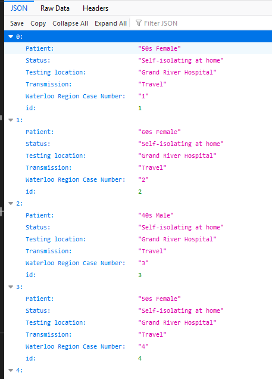

# Covid-Backend
Custom REST API for [CovidKWTracker](https://github.com/AbhinavA10/CovidTracker), built with Flask.

This flask application is hosted on Heroku using the [Procfile](./Procfile)

API Endpoint: https://covid-kw.herokuapp.com/api/v1/cases/all

API Output, in JSON: 

## Reference Points

- https://www.dataquest.io/blog/web-scraping-tutorial-python/
- https://www.regionofwaterloo.ca/en/health-and-wellness/positive-cases-in-waterloo-region.aspx#
- https://stackabuse.com/deploying-a-flask-application-to-heroku/
- https://devcenter.heroku.com/articles/procfile#procfile-format
- https://www.digitalocean.com/community/tutorials/how-to-serve-flask-applications-with-gunicorn-and-nginx-on-ubuntu-18-04
- https://devcenter.heroku.com/articles/getting-started-with-python#run-the-app-locally
- https://programminghistorian.org/en/lessons/creating-apis-with-python-and-flask#lesson-goals